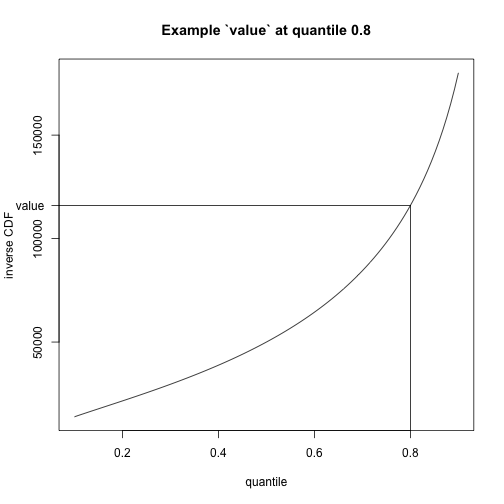

Data submission instructions
============================

This page is intended to provide teams with all the information they
need to submit forecasts. All forecasts should be submitted directly to
the [data-processed/](./) folder. Data in this directory should be added
to the repository through a pull request so that automatic data
validation checks are run.

These instructions provide detail about the [data
format](#Data-formatting) as well as [validation](#Data-validation) that
you can do prior to this pull request. In addition, we describe
[meta-data](#Metadata) that each model should provide.

*Table of Contents*

-   [What is a forecast](#What-is-a-forecast)
-   [ground truth data](#ground-truth-data)
-   [data formatting](#Data-formatting)
-   [forecast file format](#Forecast-file-format)
-   [forecast data validation](#Forecast-validation)
-   [retractions](#retractions)
-   [weekly ensemble and visualization deployment](#Weekly-build)
-   [policy on late submissions](#policy-on-late-or-updated-submissions)

What is a forecast
-----------------

Models at the COVID-19 Forecast Hub are asked to make specific quantitative forecasts about data that will be observed in the future. These forecasts are interpreted as "unconditional" predictions about the future. That is, they are not predictions only for a limited set of possible future scenarios in which a certain set of conditions (e.g. vaccination uptake is strong, or new social-distancing mandates are put in place) hold about the future -- rather, they should characterize uncertainty across all reasonable future scenarios. In practice, all forecasting models make some assumptions about how current trends in data may change and impact the forecasted outcome; some teams select a "most likely" scenario or combine predictions across multiple scenarios that may occur. Forecasts submitted to the [COVID-19 Forecast Hub](https://covid19forecasthub.org/) will be evaluated against observed data. 

We note that other efforts, such as the [COVID-19 Scenario Modeling Hub](https://covid19scenariomodelinghub.org/), have been launched to collect and aggregate model outputs from "scenario projection" models. These models create longer-term projections under a specific set of assumptions about how the main drivers of the pandemic (such as non-pharmaceutical intervention compliance, or vaccination uptake) may change over time.

Ground truth data
-----------------

The COVID-19 Forecast Hub treats case and death data on COVID-19 from 
JHU CSSE as "ground truth" data. Slightly different versions of these data are also 
available from USA FACTS and the NY Times. Hospitalization ground truth 
data are from HealthData.gov. We create processed versions of these data
that are stored in this repository. 

Details on how ground truth data are defined can be found in 
the [data-truth folder README file](../data-truth/README.md).

Technical details about how and when the truth data are updated and 
checked for validity can be found on 
[the Hub Wiki page about truth data](https://github.com/reichlab/covid19-forecast-hub/wiki/Truth-Data).

Data formatting
---------------

The automatic check validates both the filename and file contents to
ensure the file can be used in the visualization and ensemble
forecasting.

### Subdirectory

Each subdirectory within the [data-processed/](data-processed/)
directory has the format

    team-model

where

-   `team` is the teamname and
-   `model` is the name of your model.

Both team and model should be less than 15 characters and not include
hyphens.

Within each subdirectory, there should be a metadata file, a license
file (optional), and a set of forecasts.

### Metadata

The metadata file should have the following format

    metadata-team-model.txt

and here is [the structure of the metadata
file](https://github.com/reichlab/covid19-forecast-hub/blob/master/data-processed/METADATA.md).

### License (optional)

If you would like to include a license file, please use the following
format

    LICENSE.txt

If you are not using one of the [standard
licenses](https://github.com/reichlab/covid19-forecast-hub/blob/master/code/validation/accepted-licenses.csv),
then you must include a license file.

### Forecasts

Each forecast file within the subdirectory should have the following
format

    YYYY-MM-DD-team-model.csv

where

-   `YYYY` is the 4 digit year,
-   `MM` is the 2 digit month,
-   `DD` is the 2 digit day,
-   `team` is the teamname, and
-   `model` is the name of your model.

The date YYYY-MM-DD is the [`forecast_date`](#forecast_date).

The `team` and `model` in this file must match the `team` and `model` in
the directory this file is in. Both `team` and `model` should be less
than 15 characters, alpha-numeric and underscores only, with no spaces
or hyphens.

Forecast file format
--------------------

The file must be a comma-separated value (csv) file with the following
columns (in any order):

-   `forecast_date`
-   `target`
-   `target_end_date`
-   `location`
-   `type`
-   `quantile`
-   `value`

No additional columns are allowed.

Each row in the file is either a point or quantile forecast for a
location on a particular date for a particular target.

### `forecast_date`

Values in the `forecast_date` column must be a date in the format

    YYYY-MM-DD

This is the date on which the submitted forecast were available. This
will typically be the date on which the computation finishes running and
produces the standard formatted file. `forecast_date` should correspond
and be redundant with the date in the filename, but is included here by
request from some analysts. We will enforce that the `forecast_date` for
a file must be either the date on which the file was submitted to the
repository or the previous day. Exceptions will be made for legitimate
extenuating circumstances.

### `target`

Values in the `target` column must be a character (string) and be one of
the following specific targets:

-   “N wk ahead cum death” where N is a number between 1 and 20
-   “N wk ahead inc death” where N is a number between 1 and 20
-   “N wk ahead inc case” where N is a number between 1 and 8
-   “N day ahead inc hosp” where N is a number between 0 and 130

For county locations, the only target should be “N wk ahead inc case”.

For week-ahead forecasts, we will use the specification of
epidemiological weeks (EWs) [defined by the US
CDC](https://wwwn.cdc.gov/nndss/document/MMWR_Week_overview.pdf) which
run Sunday through Saturday. There are standard software packages to
convert from dates to epidemic weeks and vice versa. E.g.
[MMWRweek](https://cran.r-project.org/web/packages/MMWRweek/) for R and
[pymmwr](https://pypi.org/project/pymmwr/) and
[epiweeks](https://pypi.org/project/epiweeks/) for python.

We have created [a csv
file](../template/covid19-death-forecast-dates.csv) describing forecast
collection dates and dates for which forecasts refer to can be found.

For week-ahead forecasts with `forecast_date` of Sunday or Monday of
EW12, a 1 week ahead forecast corresponds to EW12 and should have
`target_end_date` of the Saturday of EW12. For week-ahead forecasts with
`forecast_date` of Tuesday through Saturday of EW12, a 1 week ahead
forecast corresponds to EW13 and should have `target_end_date` of the
Saturday of EW13.

#### N wk ahead cum death

This target is the cumulative number of deaths predicted by the model up
to and including N weeks after `forecast_date`.

A week-ahead forecast should represent the cumulative number of deaths
reported on the Saturday of a given epiweek.

Predictions for this target will be evaluated compared to the cumulative
of the number of new reported cases, as recorded by [JHU
CSSE](https://github.com/CSSEGISandData/COVID-19/blob/master/csse_covid_19_data/csse_covid_19_time_series/time_series_covid19_deaths_US.csv).

#### N wk ahead inc death

This target is the incident (weekly) number of deaths predicted by the
model during the week that is N weeks after `forecast_date`.

A week-ahead forecast should represent the total number of new deaths
reported during a given epiweek (from Sunday through Saturday,
inclusive).

Predictions for this target will be evaluated compared to the number of
new reported cases, as recorded by [JHU
CSSE](https://github.com/CSSEGISandData/COVID-19/blob/master/csse_covid_19_data/csse_covid_19_time_series/time_series_covid19_deaths_US.csv).

#### N wk ahead inc case

This target is the incident (weekly) number of cases predicted by the
model during the week that is N weeks after `forecast_date`.

A week-ahead forecast should represent the total number of new cases
reported during a given epiweek (from Sunday through Saturday,
inclusive).

Predictions for this target will be evaluated compared to the number of
new reported cases, as recorded by [JHU
CSSE](https://github.com/CSSEGISandData/COVID-19/blob/master/csse_covid_19_data/csse_covid_19_time_series/time_series_covid19_confirmed_US.csv).

#### N day ahead inc hosp

This target is the number of new daily hospitalizations predicted by the
model on day N after `forecast_date`.

As an example, for day-ahead forecasts with a `forecast_date` of a
Monday, a 1 day ahead inc hosp forecast corresponds to the number of
incident hospitalizations on Tuesday, 2 day ahead to Wednesday, etc….

Currently there is no “gold standard” for hospitalization data.

#### REMOVED targets

On 2020-06-06, these targets were removed:

-   N day ahead inc death
-   N day ahead cum death

### `target_end_date`

Values in the `target_end_date` column must be a date in the format

    YYYY-MM-DD

This is the date for the forecast `target`. For “\# day” targets,
`target_end_date` will be \# days after `forecast_date`. For “\# wk”
targets, `target_end_date` will be the Saturday at the end of the week
time period.

### `location`

Values in the `location` column must be one of the “locations” in this
[FIPS numeric code file](../data-locations/locations.csv) which includes
numeric FIPS codes for U.S. states, counties, territories, and districts
as well as “US” for national forecasts.

Please note that when writing FIPS codes, they should be written in as a
character string to preserve any leading zeroes.

### `type`

Values in the `type` column are either

-   “point” or
-   “quantile”.

This value indicates whether that row corresponds to a point forecast or
a quantile forecast. Point forecasts are used in visualization while
quantile forecasts are used in visualization and in ensemble
construction.

**When point forecasts are not included, the median for every
location-target pair will be used.**

### `quantile`

Values in the `quantile` column are either “NA” (if `type` is “point”)
or a quantile in the format

    0.###

For quantile forecasts, this value indicates the quantile for the
`value` in this row.

Teams should provide the following 23 quantiles:

    c(0.01, 0.025, seq(0.05, 0.95, by = 0.05), 0.975, 0.99)

    ##  [1] 0.010 0.025 0.050 0.100 0.150 0.200 0.250 0.300 0.350 0.400 0.450 0.500
    ## [13] 0.550 0.600 0.650 0.700 0.750 0.800 0.850 0.900 0.950 0.975 0.990

for all `target`s except “N wk ahead inc case” target. For the “N wk
ahead inc case” target, teams should provide the following 7 quantiles:

    c(0.025, 0.100, 0.250, 0.500, 0.750, 0.900, 0.975)

    ## [1] 0.025 0.100 0.250 0.500 0.750 0.900 0.975

### `value`

Values in the `value` column are non-negative numbers indicating the
“point” or “quantile” prediction for this row. For a “point” prediction,
`value` is simply the value of that point prediction for the `target`
and `location` associated with that row. For a “quantile” prediction,
`value` is the inverse of the cumulative distribution function (CDF) for
the `target`, `location`, and `quantile` associated with that row.

An example inverse CDF is below.

From 4/22/2021 we will be accepting `NULL` values in this column. The purpose
of `NULL` is to indicate the retraction of previously forecasted values. More
details can be found in the [retractions](#retractions) section.

Forecast validation
-------------------

To ensure proper data formatting, pull requests for new data in
data-processed/ will be automatically run.

### Pull request forecast validation

When a pull request is submitted, the data are validated through [Github Actions](https://docs.github.com/en/actions) which runs the tests present in [the validations repository](https://github.com/reichlab/covid19-forecast-hub-validations). The intent
for these tests are to validate the requirements above and specifically
enumerated [on the
wiki](https://github.com/reichlab/covid19-forecast-hub/wiki/Validation-Checks#current-validation-checks).
Please [let us
know](https://github.com/reichlab/covid19-forecast-hub/issues) if the
wiki is inaccurate or if you're facing issues while running the tests.

If the pull request fails, please [follow these
instructions](https://github.com/reichlab/covid19-forecast-hub/wiki/Troubleshooting-Pull-Requests)
for details on how to troubleshoot.

#### Run checks locally

To run these checks locally rather than waiting for the results from a
pull request, follow [these
instructions](https://github.com/reichlab/covid19-forecast-hub/wiki/Validation-Checks#running-validations-locally).

### R validation checks

If you cannot get the python checks to run, you can use [these
instructions](R_forecast_file_validation.md) to run some checks in R.
These checks are no longer maintained, but may still be of use to teams
working with R.

### Retractions checks

Conforming to new rules being enforced starting 4/22/2021 with the introduction
of retractions, newer/updated forecast files that have the same forecast date in
the file name must now include all previously forecasted points; i.e., the updated
forecast file cannot contain fewer rows than the previous one, and must include
all (`forecast_date`, `target`, `target_end_date`, `location`, `type`, `quantiles`)
combinations that were present in the previous forecast file. In case one of these rows are to be retracted, follow the instructions under in the next section.

Retractions
-----------

From 4/22/2021 we will be formally introducing the idea of a _retracted_ forecast.

A retracted forecast point is a updated forecast point with a `NULL` value (previously non-`NULL`)
but the same `forecast_date`, `target`, `target_end_date`, `location`, `type`,
and/or `quantiles` (if applicable); A retracted forecast is a new forecast file with the same
forecast date in the file name that contains such retracted points. Forecast teams can both retract
and update forecasts in one forecast file.

The purpose of this new idea is to enable the original data to have an explicit track-record
of forecasts that were made in earlier versions and then subsequently were removed for any reason.
This way, forecasting teams will have a way to retract previously made forecasts but evaluators will
not lose the ability to retrieve previously retracted forecasts. A detailed description and discussion
of this idea can be found on [this page](https://docs.zoltardata.com/ReleaseNotes4_0/) of the Zoltar 
documentation website, starting from 4/22/2021.

All forecasts containing `NULL` values will be subjected to review for the foreseeable future, as we understand
this is a big change and the correct semantics of `NULL` values may not be immediately clear.

Weekly build
-----------

Every Monday at 3pm ET, we will update our [COVID Forecast Hub ensemble forecast](https://covid19forecasthub.org/doc/ensemble/) using the most recent valid forecast from each team. Additional details on model eligibility are available on [the page describing the ensemble](https://covid19forecasthub.org/doc/ensemble/). Details on which models were included each week in the ensemble are available in the [ensemble metadata](https://github.com/reichlab/covid19-forecast-hub/tree/master/ensemble-metadata) folder.

Policy on late or updated submissions
------------------

In order to ensure that forecasting is done in real-time, all forecasts should be submitted to the forecast hub within 1 day of the forecast date.  We do not accepting late forecasts due to technical issues, missed deadlines, or updated modeling methods. We will accept updated forecasts if there was a bug in the original file. If you need to submit an updated forecast for this reason, please include a comment in your pull request confirming that there was a bug and that the forecast was fit only to data available at the time. We also accept late forecasts from new teams if they can provide publicly available information showing that the forecasts were made in real-time (e.g. GitHub commit history).
