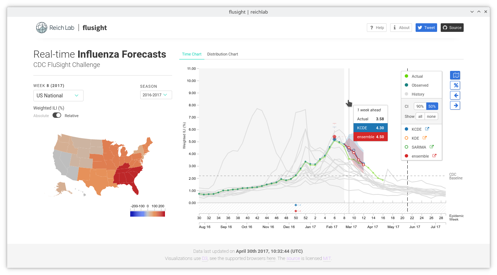

---

Flusight is a static influenza forecasts visualizer. It takes weekly prediction
files in the
[format]((https://github.com/cdcepi/FluSight-forecasts/blob/master/2016-2017_submission_template.csv))
used by [CDC FluSight Challenge](https://predict.phiresearchlab.org/), extracts
entities needed for visualization and generates a minified webpage ready for
static hosting. The visualizer uses an intermediate file, summarizing the
predictions, which can be generated either by the set of scripts in the
repository (which uses CDC's prediction format) or by the user. Visualizations
are implemented using the [d3-foresight npm
package](https://www.npmjs.com/package/d3-foresight).

The live version associated with this github repository at
[http://reichlab.io/flusight/](http://reichlab.io/flusight/) displays
predictions for CDC FluSight Challenge by [Reich Lab](http://reichlab.io/) at
UMass Amherst. To know more about it, go to the
[about](https://github.com/reichlab/flusight/wiki/About) page in the
[wiki](https://github.com/reichlab/flusight/wiki).

[](https://github.com/feross/standard)

[](https://zenodo.org/badge/latestdoi/69420249)
[](https://travis-ci.org/reichlab/flusight)
[](https://github.com/reichlab/flusight/pulls)



## Quickstart

For submitting weekly predictions on this
[repository](https://github.com/reichlab/flusight) the recommended method is to
create a pull request on the master branch. Fork this project and add your
`.csv` files in `./data/` directory as described in the project’s workflow
[wiki](https://github.com/reichlab/flusight/wiki/Workflow). The pull requests
will be automatically built and once merged to master, will be deployed to the
website.

## Build it yourself

Flusight works as a static webpage and needs a static hosting service (like
github’s). Building the project and bundling data files requires
[node.js](https://nodejs.org/en/download/) and
[yarn](https://yarnpkg.com/en/docs/install) (or [npm](https://www.npmjs.com/)).

+ Clone this repository

  `git clone git@github.com:reichlab/flusight.git && cd ./flusight`

+ Install dependencies

  `yarn`
  
+ Put prediction submission files in `./data` as described in
  the [wiki](https://github.com/reichlab/flusight/wiki/Workflow)

+ Parse prediction files to generate data files in `./src/assets/data/`

  `yarn run parse`
  
+ Test if the collected data files are fine

  `yarn run test`
  
+ Bundle production build

  `yarn run build`

+ Host it somewhere. Copy over contents from `./dist` to your hosting service.

+ Alternatively, a quick deploy to github pages can be done by running
  
  `yarn run deploy`
  
  *Remember to point `git remote origin` to the repository where you want the
  deployment to take place*
  
  
In case you want to generate the data files yourself, you can replace the
parsing and data collection step with your own but make sure to check for data
compliance (`yarn run test`). Head over to the
[wiki](https://github.com/reichlab/flusight/wiki) to know more.

## Development

> On this repository, commits to `master` are automatically built and deployed
> to `gh-pages` with travis. `master` contains most recent *working* version.
> `develop` contains the latest commits.

``` shell
# serve with hot reload at localhost:8080
yarn run dev

# build for production with minification
yarn run build
```

Go to the development
[wiki](https://github.com/reichlab/flusight/wiki/Development) for more details.

## Contributing

Contributions are welcome. Use the github [issue
tracker](https://github.com/reichlab/flusight/issues) to submit issues. Submit
pull requests [here](https://github.com/reichlab/flusight/pulls).
