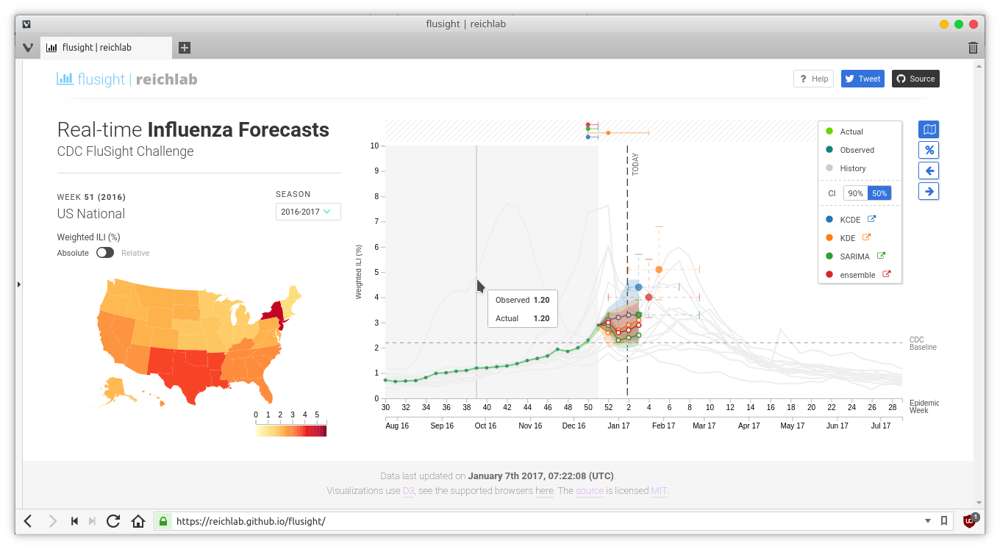

# Summary

The rapid emergence of infectious disease outbreaks from both new and known pathogens remains a critical concern of health officials worldwide. Improving communication between teams of scientific researchers who assemble forecasts of outbreaks before and during epidemics, and policy makers who could integrate these data into decicion-making has been identified as a critical area for innovation.[@Chretien2015]

In an attempt to address this issue, we have developed flusight, a tool for visualizing infectious disease forecasts. It provides an interactive interface for real-time comparison, exploration, and evaluation of infectious disease forecast models over time and geographic regions. A version is live [here](https://reichlab.github.io/flusight/), with forecasts of influenza in the US that are updated weekly during the US influenza season.

Flusight uses D3 [@d3] for generating visualizations from a single static file that summarizes the entities to be visualized (such as, predicted and actual weekly influenza incidence, predicted week with the peak incidence for the season, etc...). It is written to keep hosting overhead minimal and pre-generates the data file by parsing model predictions and live influenza data from delphi-API [@delphi_api]. All content is  bundled into a static web page. The data collection step can be replaced to visualize data and forecasts from custom sources instead of the ones used in the current repository. This allows future users to plug in similar time-series-based disease prediction models for visualization. 

This application has potential to be widely used by infectious disease forecasters who generate forecasts in real-time. In this way, we hope that flusight will facilitate dissemination, comparison, and standardized evaluation of outbreak predictions.

# References
